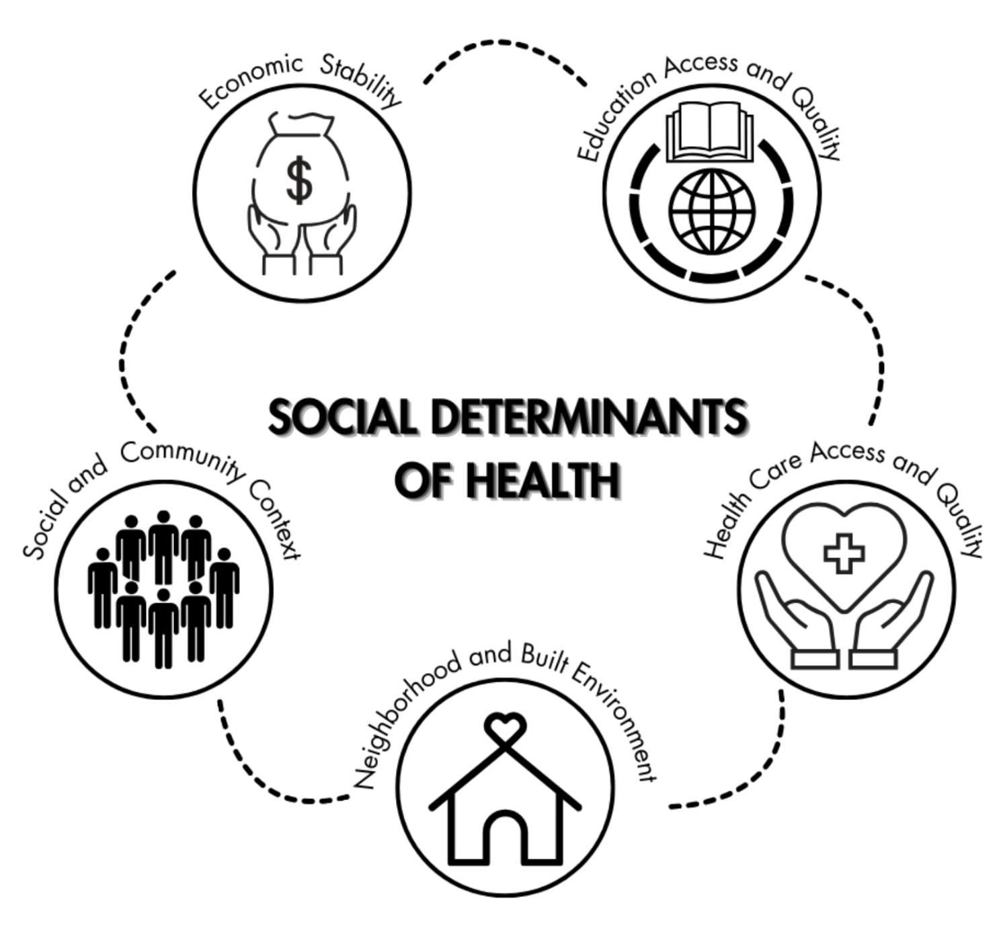
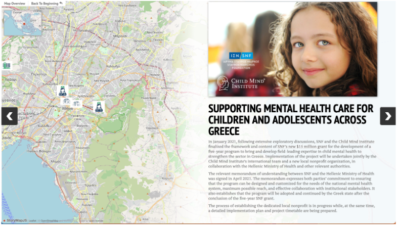
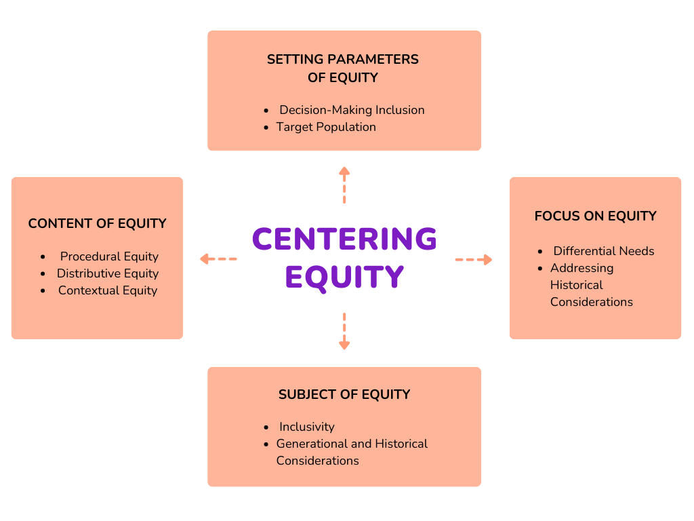

# The SDOH & Place Toolkit

Website: https://sdohplace.org/

## Overview

Enhance your health and equity initiatives with our toolkit. You will be able to create captivating spatial visualizations for community engagement using free and user-friendly tools including open-source GIS tools.

## Team

The team is based out of the Department of Geography & GIScience at the University of Illinois in Urbana, Illinois.
- Marynia Kolak, PI
- Catherine Discenza, GRA
- Kamaria Barronville, Instructional Designer
- Laila Ismail, RA
- Shubham Kumar, Designer
- Jose Alavez, Postdoc
- Marc Astacio-Palmer, Research Coordinator

## Preface

### SDOH & Place

When we talk about the factors that shape our health, it's not just about biology or lifestyle—it's about where we live and the complex tapestry of history, society, and economy that frames our lives. The [social determinants of health (SDOH)](https://www.cdc.gov/about/sdoh/index.html) encompass a range of historical, social, cultural, and economic factors that significantly impact the well-being of individuals and their communities. These social determinants of health (SDOH) aren't just statistics; they're stories of communities and the places we call home, varying from one street to the next. They're about whether we have parks over parking lots, fresh food on shelves, and whether our neighborhoods are marked by support or segregation.

Social Determinants of Health, graphic created by Kamaria Barronville

Academics, activists, government agents, and policymakers have employed data visualizations to examine the connections between places and the social determinants of health (SDOH). For example, they have utilized dashboards to study the impact of COVID-19 on vulnerable communities. They implemented [participatory mapping](https://www.cdc.gov/pcd/issues/2020/20_0123.htm) to advocate for policy-based interventions, and deployed [story maps](https://uploads.knightlab.com/storymapjs/ddf1b1212ec9c9aac4bebe45196b367d/hi-update-english/index.html) to promote health initiatives. To produce these data visualizations, health researchers and advocates mobilize a wide array of conceptual frameworks and diverse technical skill sets. Moreover, data visualizations in public health do not only analyze the relationship between places and SDOH. They promote health equity: "a state in which everyone has a fair and equitable opportunity to achieve their highest level of health" (CDC's Office of Health Equity, 2022).

### Public Health, Equity, and Spatial Data Visualizations 

Visualizing public health data isn't just about the 'what'—it's about the 'so what?' It's about crafting digital narratives that anyone can access, understand, and use to make a difference. These visual tools are our digital megaphones and meeting places—they bring us together, keep us informed, and push us towards action. [Data visualizations](https://www.ahrq.gov/data/visualizations/index.html#:~:text=AHRQ's%20interactive%20data%20visualization%20tools,coverage%2C%20and%20emergency%20department%20visits.) in public health that advance equity are digital tools designed to provide accessible and comprehensive data related to public health indicators, focusing on reducing health disparities and promoting equity among different populations. These tools often combine various data sources and visualization techniques to present information in a user-friendly and easily understandable format.

The data dashboard, for example, was a commonly used tool during the COVID-19 pandemic to communicate community spread (source: https://geodacenter.github.io/covid/)

Data visualizations can be used by community members and organizations, research groups, policymakers, and more to empower individuals to better access and mobilize social determinants of health (SDOH) data and advance [health equity](https://www.cdc.gov/healthequity/whatis/index.html).
Within the realm of public health, maps, dashboards, and interactive web applications can be created to foster fairness through an inclusive design that accommodates diverse user groups and their varying degrees of health equity. These tools are not only visually appealing and easy to comprehend, they also provide valuable insights. They adapt to the needs of different social actors by combining well-suited graphics, animations, and audio-visual elements. They even offer networking tools (e.g., messaging boards) for seamless data exchange and user interaction. These interactive features also serve to promptly update users about any alterations.

The Stavros Niarchos Foundation from Greece produced a storymap to present their current health initiatives (source: https://uploads.knightlab.com/storymapjs/ddf1b1212ec9c9aac4bebe45196b367d/hi-update-english/index.html)

#### Project Tip:

The concept of equity in public health data visualizations goes beyond mere stylistic enhancements to aid in comprehension or research. It extends to encompass connections to pertinent resources and diverse language options, for example, empowering communities with information, processes, and agency to transform, advocate for, and influence residents, neighborhoods, and broader political, economic, and social structures towards healthier systems.

Let's dive deeper into how we can make data visualizations not just informative, but also inclusive and impactful. You see, it's not all about graphs and numbers. By weaving in stories and multimedia—like videos and interactive media streams—we open up a world where data talks to everyone, not just to those who love statistics.

Imagine a dashboard that not only shows you the trends but also tells you the stories behind the numbers. It's designed with real people in mind, adapting to a variety of preferences—whether you’re someone who loves a good narrative or someone who digs deep into the data.

However, we've got to acknowledge that sometimes, our public health systems fall short. They miss the mark on painting the full picture of health disparities. That’s why, when we're talking about Place & SDOH, we need to put equity at the heart of our work—from the word go, right through to the final pixel of the design. It's not just a 'nice-to-have'; it's a must-do for visualizations that truly resonate with and serve all communities.

#### What does it mean to center equity in your work?

The [equity orientation in a public health data system](https://www.ncbi.nlm.nih.gov/pmc/articles/PMC9508440/) involves several key components that must be outlined to address health disparities and promote equitable outcomes effectively. 

These components include:

#### Setting Parameters of Equity:
- Decision-Making Inclusion: The process of setting parameters for equity should involve diverse stakeholders, including representatives from marginalized communities, to ensure that the perspectives and needs of all affected populations are considered.
- Target Population: It is crucial to identify the specific populations and communities that are the focus of efforts to improve equity. This includes recognizing vulnerable groups that historically experience disparities in health outcomes.

#### Focus on Equity:
- Differential Needs: An equity-oriented approach acknowledges that different populations have varying needs and histories. It recognizes the importance of tailoring interventions to address these disparities rather than assuming that a one-size-fits-all approach will be sufficient.
- Addressing Historical Considerations: An equity-oriented system acknowledges historical injustices and systemic discrimination that have contributed to current health disparities. It seeks to redress these past injustices and provide opportunities for affected communities to improve their health and well-being.

#### Subject of Equity:
- Inclusivity: The subject of equity encompasses all individuals and communities facing health disparities, including marginalized and underserved groups.
- Generational and Historical Considerations: An equity-oriented data system takes into account intergenerational and historical factors that have contributed to health disparities. It recognizes that current health outcomes are influenced by past policies and practices.

#### Content of Equity:

- Procedural Equity: This aspect of equity focuses on ensuring that the decision-making processes and procedures are perceived as fair and transparent. It involves involving affected communities in the planning, implementation, and evaluation of health interventions.
- Distributive Equity: Distributive equity concerns how social welfare and resources are distributed to meet the needs of different populations. It aims to allocate resources in a way that reduces health disparities and provides equitable access to healthcare and other essential services.
- Contextual Equity: This aspect acknowledges that pre-existing social conditions (such as poverty, discrimination, and access to resources) influence equity. An equity-oriented data system considers these contextual factors when designing interventions to address health disparities effectively.

Centering Equity (source: https://www.ncbi.nlm.nih.gov/pmc/articles/PMC9508440/, graphic created by Kamaria Barronville).

### Our Approach

The Place Project Community Toolkit connects equity principles with analysis and design of spatial visualizations for SDOH spatial data. This toolkit draws inspiration from the Robert Wood Johnson Foundation (RWJF) Commission’s findings, which assessed [how communities’s health and life expectancy are affected by the places where they live](https://www.rwjf.org/en/insights/our-research/interactives/whereyouliveaffectshowlongyoulive.html). To address this issue, RWJF has previously created resources to [promote health equity](https://www.rwjf.org/en/building-a-culture-of-health/focus-areas/Features/achieving-health-equity.html).

To complement RWJF research and outreach strategies, the Place Project Community Toolkit aims to increase the capacity for community and civic organizations in health to:

 - Access and work with SDOH data (i.e., place/spatial data)
 - Use place data for social good and to further health equity
 - Develop engaging & compelling apps to inspire, activate, and retain users
 - Work within an open ecosystem infrastructure

In order to identify and engage with the necessities of different social actors, the community toolkit is based on the principles of Human-Centered Design (HCD). HCD is a well-researched framework that ensures the potential users’ desires, abilities, and contexts are at the core of interactive systems and applications. HCD consists of four main steps: identifying users’ needs, designing for those needs, evaluating, and iterating. Inspired by HCD, the Place toolkit is built upon an ongoing co-creation and evaluation process that leverages the collaborative efforts of various stakeholders, such as researchers, policymakers, and analysts.

Currently, the community toolkit contains six modules. Depending on your project's objectives, you can opt to undertake either one module or several of them: 

 - Module 1 guides users in identifying and formulating their visualization goals, recognizing potential stakeholders, and     
  prioritizing health equity in their planning. 
 - Module 2 emphasizes the importance of user-centered design principles in spatial visualization and evaluates various 
  engagement strategies with stakeholders. 
 - Module 3 focuses on the integration of spatial data into projects, covering data-wrangling methods, technologies, and the 
  role of coordinate reference systems (CRS) in spatial visualization. 
 - Module 4 delves into the fundamentals of exploratory data analysis in the context of social determinants of health (SDOH). 
 - Module 5 introduces users to multiple low or no-code applications for creating mapping visualizations. These open-source 
  applications concentrate on four cartographic approaches for mapping SDOH: story maps, asset maps, thematic maps, and data 
  dashboards.
 - Module 6 addresses how users can evaluate and disseminate their SDOH mapping projects, underscoring the importance of 
  ongoing stakeholder engagement.
